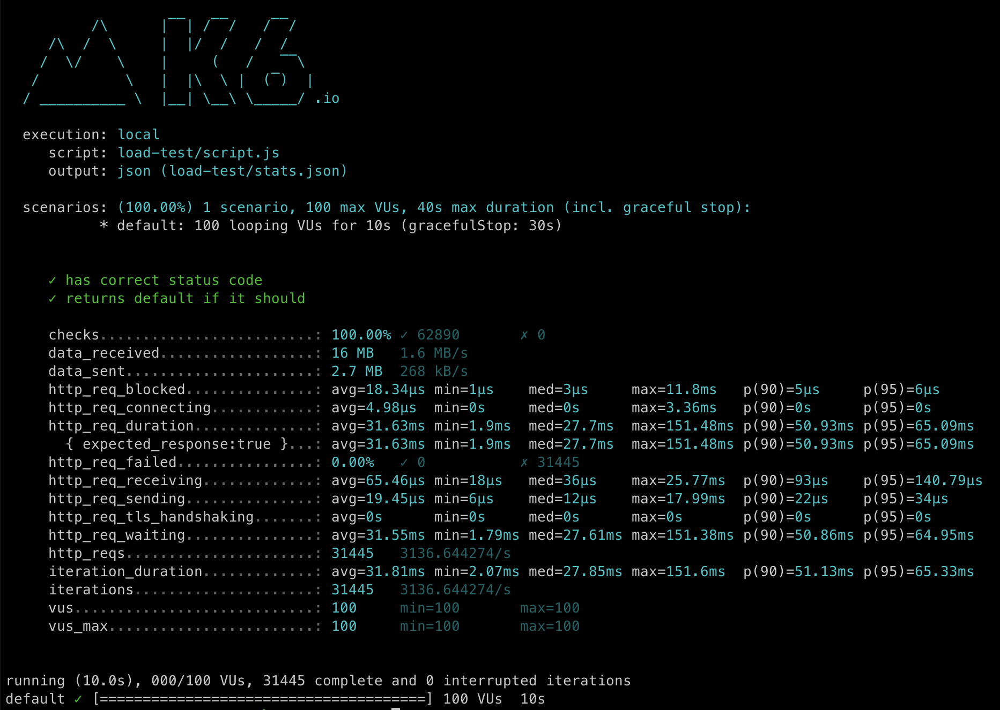

# apoor-dot-dev


_DALL-E 2's take on Ferris the crab (Rust's mascot) in a hot air baloon (Fly.io's logo)_

[](https://github.com/a-poor/apoor-dot-dev/actions/workflows/rust.yml)
[](https://github.com/a-poor/apoor-dot-dev/actions/workflows/docker-publish.yml)
[](https://github.com/a-poor/apoor-dot-dev/actions/workflows/fly.yml)

_created by Austin Poor_

A custom URL shortener for my personal use – written in Rust, build with [Tokio](https://github.com/tokio-rs/tokio) and [Axum](https://github.com/tokio-rs/axum), and deployed to Fly.io.

Try it out! Here are a few of the short links:
- Looking for my personal site? [apoor.dev/site](https://apoor.dev/site)
- Looking for my blog? [apoor.dev/blog](https://apoor.dev/blog)
- Looking for my mastodon? [apoor.dev/mastodon](https://apoor.dev/mastodon)
- Looking for my GitHub? [apoor.dev/github](https://apoor.dev/github)
- Looking for this GitHub repo? [apoor.dev/this](https://apoor.dev/this)


## Overview

I created this because I wanted a custom URL shortener to make it easier to share links and I also wanted to get more experience with writing Rust, using Tokio and Axum, and deploying to Fly.io.


## Development

The API is very simple. It has a ping endpoint, a discovery endpoint, and then an endpoint for looking up a path parameter and redirecting to the associated URL.

If a path is not found, rather than returning a 404, it will redirect to my personal site's home page.

Since the CI/CD process – with GitHub actions and Fly.io – is so fast and I have relatively few links that don't change very often, I'm not using a database. Instead I'm using a static `HashMap` that is populated at compile-time. A future iteration may include a database and/or a redis cache to maintain the state.

The binary is a bit larger than I would have expected (currently `~2.5MB`). I wonder how much of that is due to the Tokio runtime. I would think there would be some potential for improvements there as possible future work.


## Load Testing



Since I had a new API up and running, I wanted to get a better sense of its performance. I've included a [k6](https://k6.io) load-testing script in the [load-test](./load-test/) directory.

It has a median response time of `~25ms` and a p90 response time of `~50ms`.

I'm sure there's plenty of room for improvement but I think that's a good starting point.

The load tests can be run with the following command (assuming k6 is installed):

```bash
$ k6 run load-test/script.js
```


## Deployment

Deploying with Fly.io is a breeze! It can be deployed with the following command:

```bash
$ flyctl deploy
```

## Future Work

- Performance improvements
- Binary-size improvements
- Better logging
- Setting a timeout (currently Fly.io times out the application)
- Tracking Stats & Metrics (in a database?)
- Storing links externally (in Redis or a database?)

